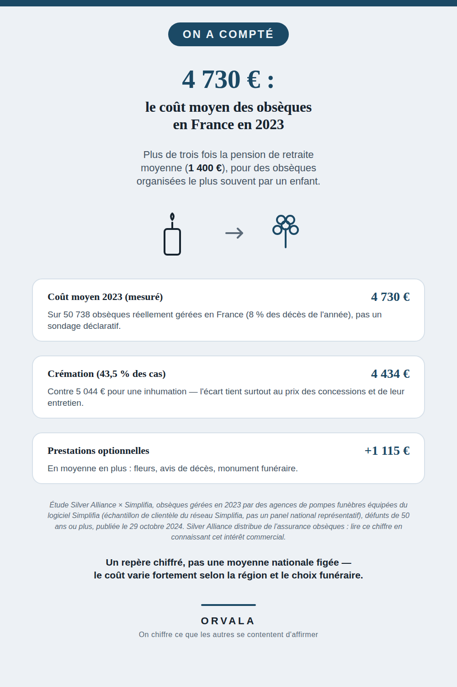

# Combien coûtent des obsèques en France ?

**4 730 €** : c'est le coût moyen des obsèques organisées en France en 2023 — plus de trois fois
la pension de retraite moyenne (1 400 €).

Série **« On a compté »** : un chiffre réel, sa décomposition, sa source affichée. Pas d'avis, pas
de conseil.

## La décomposition

| Poste | Montant | Détail |
|---|---|---|
| Coût moyen 2023 (mesuré) | **4 730 €** | Sur 50 738 obsèques réellement gérées en France (8 % des 638 266 décès de l'année) |
| Crémation | **4 434 €** | 43,5 % des obsèques du panel |
| Inhumation | **5 044 €** | L'écart tient surtout au prix des concessions funéraires et de leur entretien |
| Prestations optionnelles | **+1 115 €** en moyenne | Fleurs, avis de décès, monument funéraire |

Écarts régionaux observés par la même étude (non repris sur le visuel, ajoutés ici pour qui veut
le détail complet) : les obsèques sont les plus chères en Normandie (5 350 €), Île-de-France
(5 317 €) et Pays de la Loire (5 156 €) ; les moins chères en Occitanie (4 362 €), Provence-Alpes-
Côte d'Azur (4 399 €) et Nouvelle-Aquitaine (4 452 €).

## La source, et pourquoi elle demande une lecture prudente

Étude **Silver Alliance × Simplifia**, « Combien ça coûte de mourir en France ? », portant sur les
obsèques gérées en 2023 par des agences de pompes funèbres équipées du logiciel Simplifia, pour
des défunts de 50 ans ou plus. Publiée le 29 octobre 2024.

Source primaire : https://www.silveralliance.com/les-conseils/combien-ca-coute-de-mourir-en-france-notre-nouvelle-etude/

**Ce que cette source est, et ce qu'elle n'est pas.** Ce ne sont pas des déclarations d'un panel
d'opinion — ce sont des données réelles de gestion (factures), ce qui est méthodologiquement
plus solide qu'un sondage déclaratif. Mais l'échantillon (50 738 obsèques) est **la clientèle
des agences équipées du logiciel Simplifia**, pas un panel national tiré au hasard : ce chiffre
décrit ce réseau, pas nécessairement la France entière avec la même précision qu'un sondage par
quotas.

**Conflit d'intérêt à connaître avant de lire ce chiffre.** Silver Alliance distribue des contrats
d'assurance obsèques, et Simplifia édite le logiciel utilisé par les agences mesurées. Les deux
ont un intérêt commercial à ce que le coût des obsèques soit perçu comme élevé : un coût élevé
légitime l'achat d'une assurance obsèques, qui est justement le produit vendu par Silver Alliance.
Ce n'est pas une raison d'écarter le chiffre — les données de gestion restent réelles — mais une
raison de le lire en connaissance de cause, exactement comme pour le chiffre du coût d'un mariage
déjà documenté sur `combien-coute-un-mariage` (Mariages.net, même type de biais).

## Le visuel

---

Série « On a compté ». Autres sujets déjà publiés : coût d'un animal de compagnie, d'un mariage,
d'un déménagement, de la rentrée scolaire, des vacances d'été, de Noël, d'Halloween — liste et
liens dans [le hub](https://github.com/VincentChabran/VincentChabran).
